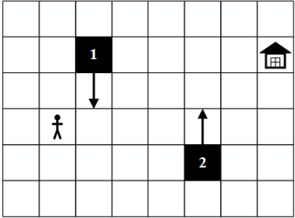
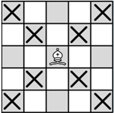

# Auditory exercise 3 - Uninformed search

## Example - Two jars

Given two jars **J0** and **J1**, having capacities of **C0** and **C1** liters, accordingly. 
Define list of actions that will bring the system to a state in which **J0** has **G0** liters, and **J1** has **G1** liters.
Actions:
- Empty a jar
- Move liquid from one jar to another without moving more than the capacity of the destination jar
- Fill a jar (homework)

##### State definition
Tuple (X, Y) with information that J0 has X liters, and J1 has Y liters. Optional value '\*', shows that the quantity of the jar is irrelevant.
Goal: Predefined state that we want to achieve. If only one jar is important, for the other we can put '\*'.

## Problem 1 - Explorer

Implement in Python a state representation about the problem for which, one of the possible initial states is like in the figure below

The little man needs to be brought to his home. The man can move on any adjacent field, horizontally or vertically. 
The obstacles 1 and 2 are moving vertically. Each of the obstacles is moving one field in the adequate direction with each movement of the little man.

Obstacle 1 moves downwards initially and Obstacle 2 upwards. Figure 2 gives an example movement of the man and the obstacles. 

 

When the obstacle reaches the end of the board, it switches direction and continues to move. 
If an obstacle and the man are on the same field, the man will be destroyed.

For all test examples, the look and size of the board are the same as in the figures. All test cases have the same initial position and movement direction for the obstacles. Each test case has a different starting position of the man and different position of the house. 

The initial code reads the input arguments for each test case. 

The movements need to be defined as follows:
- **Right** - move the man one position right
- **Left** - move the man one position left
- **Up** - move the man one position up
- **Down** - move the man one position down

Your code should have one function call that will print the man movement sequence. The movement sequence is the sequence of moves that will allow the man to reach the position of the house. 

Use uninformed search. Use the test examples to decide which variant of uninformed search to use.

## Problem 2 - Molecule

Implement in Python a state representation about the problem for which one of the possible initial states is depicted in the figure.

Three atoms are placed on a 7x9 board (note that the two H-atoms are different: the first one has a link to the right, and the second one has a link to the left). The grey fields of the board represent obstacles.

The player can begin the game by arbitrarily choosing one of the three atoms. In each step the player arbitrarily chooses exactly one of the three atoms and "pushes" that atom in one of the four directions: up, down, left or right. 

The movement of this "pushed" atom continues in the chosen direction until the atom hits in an obstacle or in one of the other atoms (the atom always stops in the field which is adjacent to a field containing an obstacle or another atom in the corresponding direction).

Atoms can’t leave the board and can’t rotate.

The goal of the game is to bring the three atoms in a position in which they form the "molecule" shown next to the board (on the right side). The game terminates in the moment when the three atoms will be placed in the required position, in arbitrary three adjacent fields of the board.

The problem must be solved using the smallest number of moves.

For all test examples, the look and size of the board are the same as in the figure. All test cases have the same positions of the obstacles. Each test case has different starting positions for all of the three atoms.
The initial code reads the input arguments for each test case.

The movements need to be named as follows:
- **RightX** - move the atom X to the right (X can be either H1, O or H2)
- **LeftX** - move the atom X to the left (X can be either H1, O or H2)
- **UpX** - move the atom X up (X can be either H1, O or H2)
- **DownX** - move the atom X down (X can be either H1, O or H2)

Your code should have one function call that prints the output on the standard screen - it should print the movement sequence of the atoms from their initial position to a goal position on the table. 

Use uninformed search. Use the test examples to decide which variant of uninformed search to use.

## Problem 3 - Stars
Implement in Python a state representation about the problem for which one of the possible initial states is depicted in the figure.

A knight, a bishop and three stars are placed on a 8x8 chess board. The knight’s movement is in the shape of the Macedonian letter Г, and there are maximum 8 possible positions a knight can land on if he moves from a given position on the board as shown in figure 2 (1 = up+up+left, 2 = up+up+right, 3 = right+right+up, 4 = right+right+down, 5 = down+down+right, 6 = down+down+left, 7 = left+left+down, 8 = left+left+up). 

The bishop’s movement on the board is diagonal. The bishop shown in figure 3 can land on any of the positions marked with X. 

The goal of the game is to collect all stars. A star is collected if a chess figure lands on the same position as the star. 

It is illegal for both figures to occupy the same position on the board, and also a figure can not leave the board. Figures do not attack each other. 
The sequence in which the figures are moved is arbitrary, i.e. at any given moment any one of the two figures can be moved.  
You need to solve the problem using the least number of moves.

For all test examples, the look and size of the board are the same as in figure 1. In each of the test cases the stars have different positions. Furthermore, each test case has different starting positions for the knight and the bishop.
The initial code reads the input arguments for each test case.

The movements of the knight have to be named as follows:
- **K1** - movement of type 1 of the knight (up + up + left)
- **K2** - movement of type 2 of the knight (up + up + right)
- **K3** - movement of type 3 of the knight (right + right + up)
- **K4** - movement of type 4 of the knight (right + right + down)
- **K5** - movement of type 5 of the knight (down + down + right)
- **K6** - movement of type 6 of the knight (down + down + left)
- **K7** - movement of type 7 of the knight (left + left + down)
- **K8** - movement of type 8 of the knight (left + left + up)

The movements of the bishop have to be named as follows:
- **B1** - movement of type 1 of the bishop (move the bishop one field in up-left direction)
- **B2** - movement of type 2 of the bishop (move the bishop one field in up-right direction)
- **B3** - movement of type 3 of the bishop (move the bishop one field in down-left direction)
- **B4** - movement of type 4 of the bishop (move the bishop one field in down-right direction)

Your code should have one function call that prints the output on the standard screen - it should print the movement sequence of the figures needed to collect all three stars. 
Use uninformed search. Use the test examples to decide which variant of uninformed search to use.

